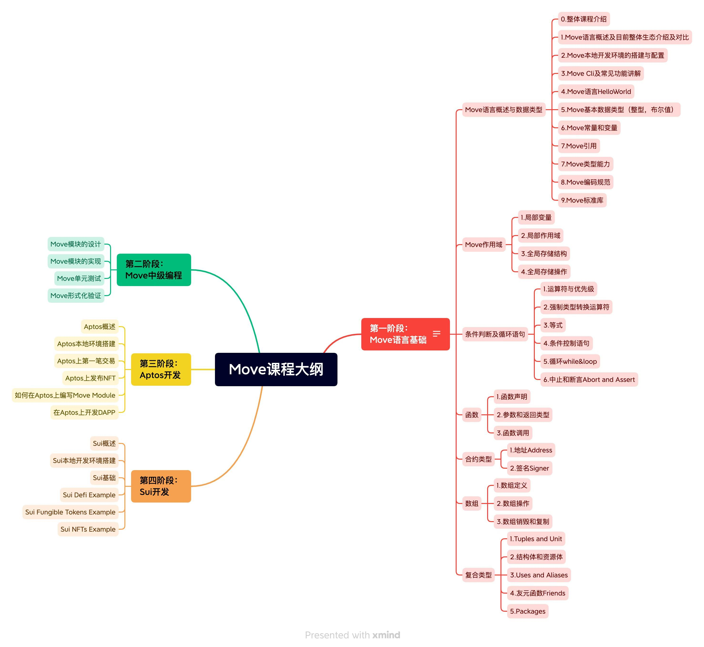

# Move 教程

Hello，这里是[MoveDAO](https://movedao.club/)为Move初学者准备的教程。本教程以[Move Book](https://move-language.github.io/move/)为主线（[Move Book中译版](https://move-dao.github.io/move-book-zh/)），辅以[Aptos Example](https://github.com/aptos-labs/aptos-core/tree/main/aptos-move/move-examples)以及[SUI Example](https://github.com/MystenLabs/sui/tree/main/sui_programmability/examples)，提供完整的Move相关知识及案例。希望为Move初学者提供平滑的学习曲线，培养更多Move开发者。本教程针对Move初学者，希望你有一定的开发经验。有经验的Move开发者也欢迎给出建议及指点。好了，让我们开始吧！

